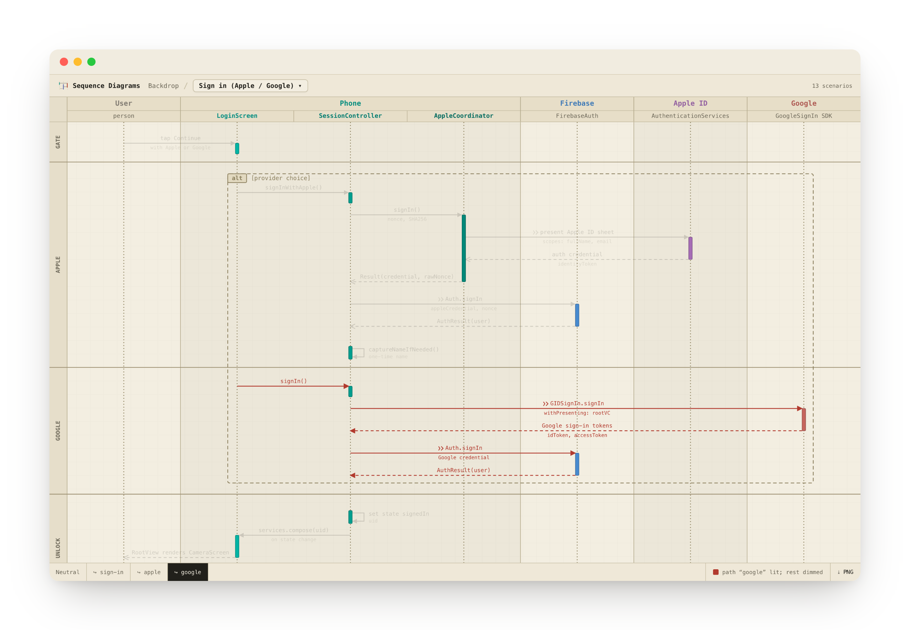
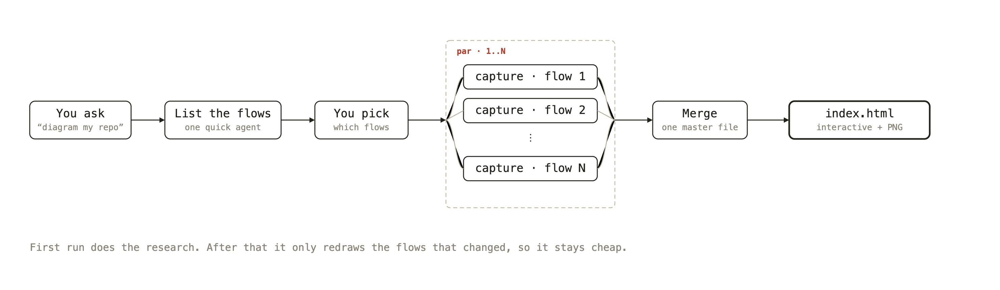
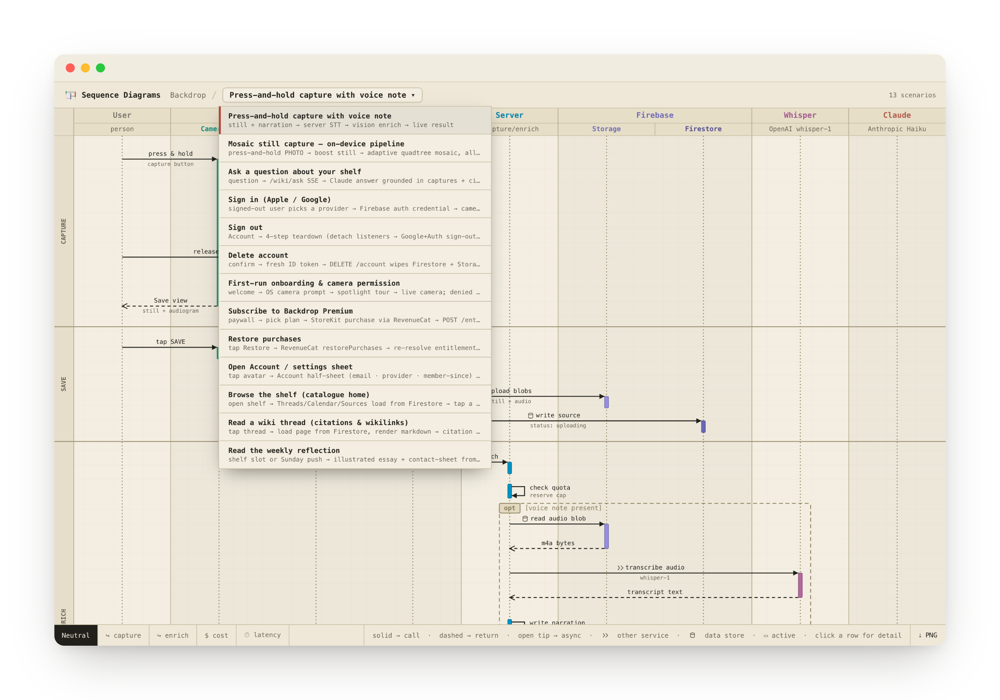
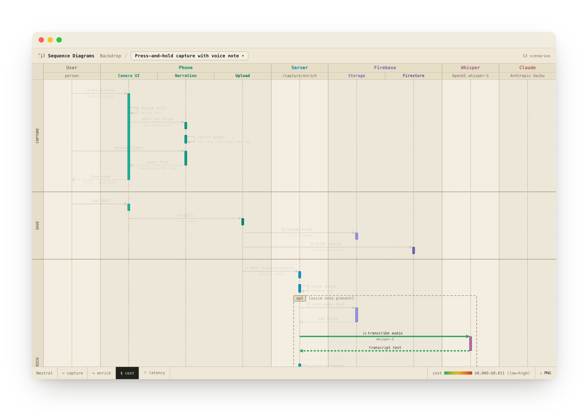
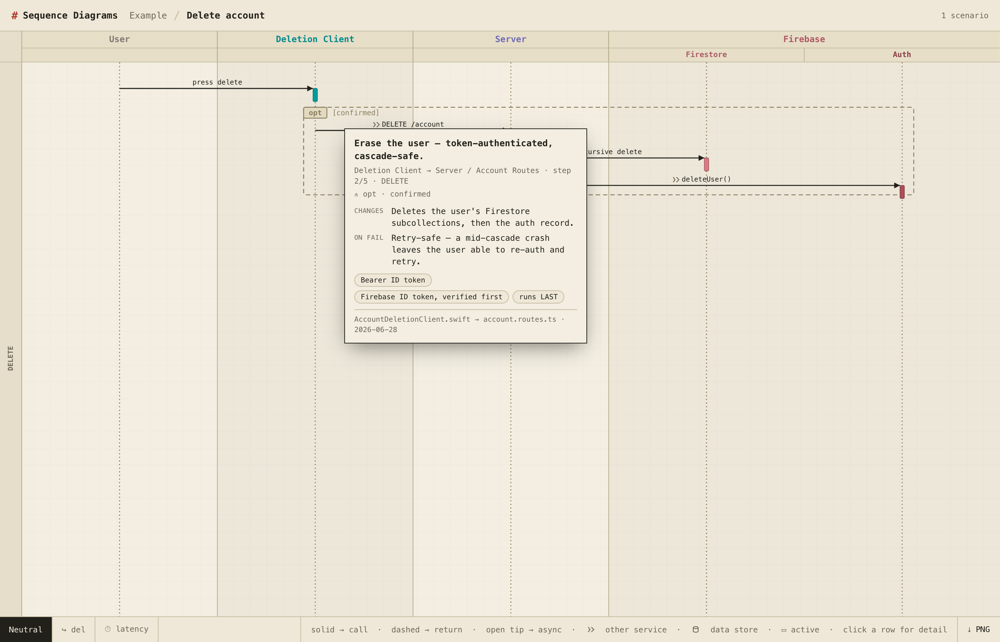

<div align="center">

<picture>
  <source media="(prefers-color-scheme: dark)" srcset="docs/img/logo-dark.png">
  
</picture>


<br>



<em>A real flow, drawn from code. Click a row, switch scenarios, export a PNG.</em>

</div>

---

## What it is

It turns a flow you describe into a real, interactive sequence diagram.

You write a little JSON (or just ask your agent), and it builds one self-contained `index.html` you can open, click around, and export as a PNG. The look is fixed, so you never pick colours or fight the layout. You describe what happens; it draws it the same way every time.

It's an [Agent Skill](https://code.claude.com/docs/en/skills): a folder with a `SKILL.md` and a Python script. So it works in Claude Code, Codex, Cursor, Gemini, or anything that reads skills. No Node, no build step, nothing to `pip install`.

## How it works

Point it at a repo and it maps the whole thing for you. It lists the flows, you pick the ones you want, and it sends one agent per flow to read the code. The results get merged into a single file and rendered.



The first run does the real research. After that it stays cheap, because it only redraws the flows that actually changed.

## What you get

**One file, every flow.** A whole product lives in one place. Switch between scenarios from a dropdown, with the same lanes and colours each time.



**Colour lenses.** Light up one path from start to finish, or shade the arrows by cost or latency. The scale matches your real numbers.



**Click any row for the story.** Why the call happens, what it changes, what breaks, and the files behind it. Your agent fills this in while it reads the code.



**Export to PNG.** One click in the toolbar saves the whole diagram, swimlane header and all, as a crisp PNG you can drop in a doc or a PR.

You also get UML arrows (call, return, async), markers for network calls vs data stores, phase bands, `opt` / `alt` / `loop` boxes, and a sticky header.

## Quickstart

```bash
git clone https://github.com/functioncall/sequence-diagram-skill.git

# Claude Code (user scope, available everywhere):
cp -r sequence-diagram-skill/sequence-diagram ~/.claude/skills/

# render the smallest example to see it live:
python3 sequence-diagram-skill/sequence-diagram/scripts/render_html.py \
        sequence-diagram-skill/sequence-diagram/examples/web-request.json index.html
open index.html
```

Python 3, standard library only. Nothing to install, no Node, no build. (PNG export runs in the browser.) Using another agent? Drop the `sequence-diagram/` folder into its skills directory, or just point the model at `sequence-diagram/SKILL.md`.

## Using it

**With an agent** (the normal way). Just ask, and the skill loads itself:

> "Diagram the checkout flow: web app, API, Stripe, Postgres, with the webhook path."
>
> "Make a sequence diagram of our login: iOS app, Firebase, Apple and Google."
>
> "Map every flow in this repo into one file I can switch between."

The agent reads the code, writes the JSON, and runs the renderer. You only describe the flow.

**By hand.** Write a spec and render it:

```bash
python3 sequence-diagram/scripts/render_html.py myflow.json index.html
```

### A spec in 30 seconds

A spec is one JSON object. Render any `examples/*.json` to see it live. Here's the shape:

```jsonc
{
  "title": "Web request, cached read",
  "subtitle": "browser to API to cache, falling back to the DB",
  "actors": [                                   // the columns, left to right (order is auto-sorted)
    { "id": "user", "label": "User", "zone": "user",   "sub_caption": "browser" },
    { "id": "api",  "label": "API",  "zone": "server", "sub_caption": "/v1" },
    { "id": "db",   "label": "Postgres", "zone": "database" }
  ],
  "messages": [                                 // arrows, top to bottom, in order
    { "phase": "REQUEST" },                     // a labelled section band
    { "from": "user", "to": "api", "text": "GET /order/42", "paths": ["read"] },
    { "from": "api",  "to": "db",  "text": "SELECT order 42", "via": "io",
      "metrics": { "latency_ms": 35 } },
    { "from": "db",   "to": "api", "text": "row", "kind": "ret" }   // "ret" is a dashed return
  ],
  "fragments": [                                // optional grouping boxes
    { "kind": "opt", "label": "cache miss", "range": [2, 3] }   // [firstMsg, lastMsg]
  ]
}
```

| Field | What it does |
|-------|--------------|
| `actors[].zone` | the swimlane role (`user`, `client`, `server`, `cache`, `database`, a vendor). It picks the colour and the left-to-right order. Don't set colours by hand. |
| `messages[].kind` | `ret` for a dashed return, `async` for an open-tip event. Leave it off for a plain call. |
| `messages[].via` | `api` for a network or trust boundary, `io` for a data-store read or write. Each draws a small marker. |
| `messages[].paths` | tags a message to a colour lens (toggle them in the bottom toolbar). |
| `messages[].metrics` | `{ cost, latency_ms }`. Turns on the cost and latency lenses. |
| `messages[].detail` | optional `{ why, sends, effects, fails, ordering, auth }`. This is the click-a-row card. |
| `{ "phase": "NAME" }` | a labelled band across the diagram. |
| `fragments[]` | `opt` / `alt` / `loop` boxes over a `[start, end]` range. |

Full reference: [`sequence-diagram/USAGE.md`](sequence-diagram/USAGE.md). Design notes: [`sequence-diagram/STYLE.md`](sequence-diagram/STYLE.md).

## Examples

Render any of these right away (`python3 sequence-diagram/scripts/render_html.py <file> index.html`):

| File | What it shows |
|------|---------------|
| [`examples/web-request.json`](sequence-diagram/examples/web-request.json) | the smallest spec. Phases, a return, one `opt` box, a colour lens. Start here. |
| [`examples/capture.json`](sequence-diagram/examples/capture.json) | a real, dense flow with metrics and a few lenses. |
| [`examples/master-backdrop.json`](sequence-diagram/examples/master-backdrop.json) | a master file. Many scenarios in one, with the dropdown above. |

## What's inside

| Path | What it is |
|------|------------|
| `SKILL.md` | the skill. When to use it and how to write specs. Read this first. |
| `USAGE.md`, `STYLE.md` | the command reference, and the design notes. |
| `scripts/render_html.py` | the renderer. `render_html.py <spec or master>.json [out.html]`. |
| `scripts/tokens.py`, `layout.py` | one source of truth for colour and size, and the geometry. |
| `scripts/assets/` | the `page.html`, `app.css`, `app.js` baked into the output. |
| `examples/` | sample specs you can render now. |

The look is frozen. You only write JSON, so it comes out the same on every run. Don't hardcode style outside `tokens.py`.

## License

MIT. The shortest license that works. [LICENSE](LICENSE)
